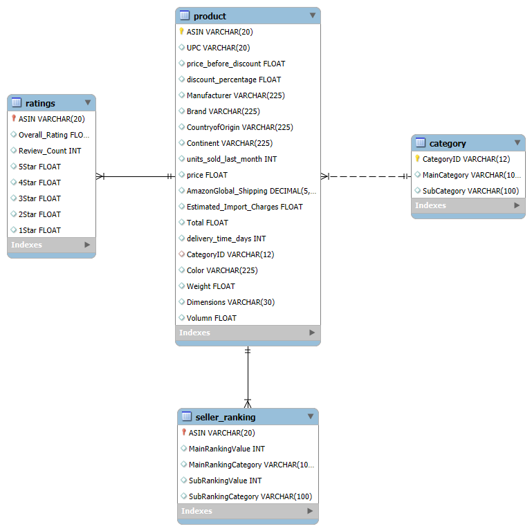

[Data Engineering] Amazon E2E Data Analyst
==========================================

Repository này bao gồm chương trình phục vụ phân tích dữ liệu của sàn thương mại điện tử. Hệ thống được xây dựng sử dụng Python, GCP Cloud Composer để điều hướng data pipeline, kho dữ liệu là BigQuery và trực quan hóa bằng Power Bi.

## Kiến trúc Data Warehouse

## System Flow

## System Components
- **GCP Cloud Composer.py**: Chương trình chính với các task Extract, Transform, Load được lập trình để phù hợp cho việc lập lịch và điều hướng task trên môi trường GCP, cụ thể là cho dịch vụ Composer.
- **staging.sql**: File SQL chứa schema và data của các bảng trong cơ sở dữ liệu Staging.
- **Tổng quan sàn thương mại điện tử Amazon.pbix**: Dashboard của chương trình, hỗ trợ phân tích insight của dữ liệu.

### Running the App
1. Upload file **GCP Cloud Composer.py** vào **GCP Cloud Storage Bucket**
2. Tạo môi trường mới trong Composer, chỉ định Bucket tới bucket đã tải file **GCP Cloud Composer.py** trước đó.
3. Chương trình được lên lịch chạy mỗi ngày 1 lần, có thể tùy chỉnh để phù hợp với yêu cầu phân tích.

## Screenshots
### Mô hình dữ liệu của CSDL Staging

### Star Schema tương ứng với các bảng fact

### Chương trình tự động chạy khi tới lịch trình

### Dashboard

